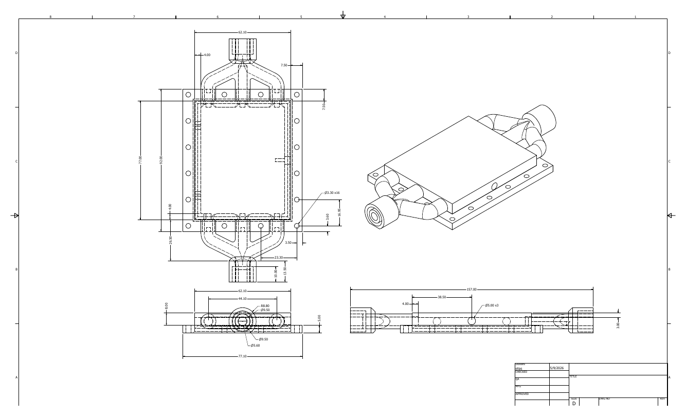
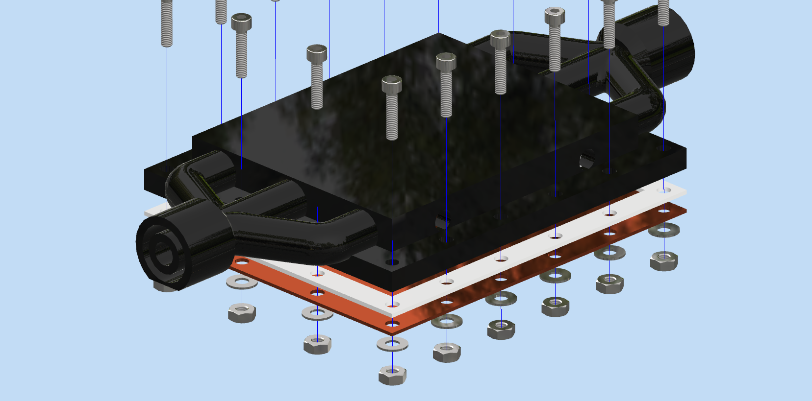
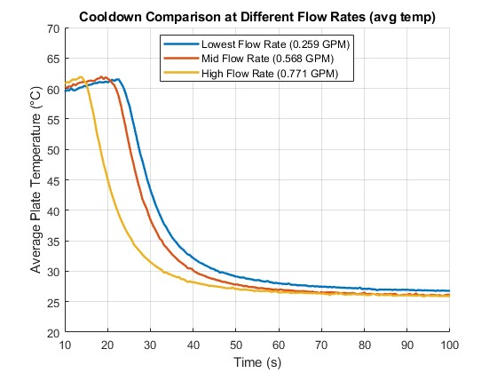
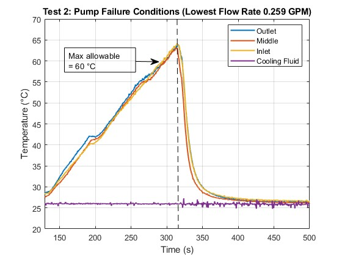

<h2>Liquid-Cooled Thermal Management Plate</h2>

   
  <em>Fig. 1 Dimensioned drawing of the cooling-plate and manifold assembly.</em>

  I designed and tested a compact liquid-cooling plate for a 22 W PTC heat
  source. The engineering objective was to maintain a safe, uniform surface
  temperature while evaluating cooling performance at different coolant flow
  rates and under pump-failure conditions.

   
  <em>Fig. 2 Exploded CAD view showing the plate, gasket, mounting hardware, and coolant manifolds.</em>

  The system combined a custom CAD assembly, sealed coolant channels,
  temperature sensors, Arduino-based data acquisition, and MATLAB data
  analysis. The assembly was designed to be compact and serviceable, with
  removable manifolds, gaskets, and bolted construction.

<h3>Engineering Achievements</h3>

<ul>
  <li>Designed a compact cooling-plate assembly with manifolds, gaskets, and bolted construction.</li>
  <li>Produced dimensioned drawings and an exploded CAD model for manufacturing and assembly.</li>
  <li>Instrumented the inlet, middle, outlet, and cooling fluid with temperature sensors.</li>
  <li>Evaluated steady-state performance, pump-failure recovery, and three coolant flow rates.</li>
  <li>Processed experimental data in MATLAB to compare temperature response and cooldown performance.</li>
</ul>

   
  <em>Fig. 3 Cooldown comparison at flow rates between 0.259 and 0.771 GPM.</em>

  Testing showed that increasing coolant flow from 0.259 to 0.771 GPM
  substantially reduced cooldown time. Although the higher flow rate cooled
  the plate more quickly, all three tests approached a similar steady-state
  temperature of approximately 26–27 °C.

   
  <em>Fig. 4 Pump-failure test showing thermal recovery after coolant circulation was restored.</em>

  A simulated pump-failure test was also performed to evaluate the system
  under an abnormal operating condition. After the plate exceeded the 60 °C
  safety limit, restoring coolant circulation rapidly reduced its temperature
  to below 30 °C. The completed prototype demonstrated effective thermal
  management, repeatable performance, and reliable recovery from coolant-flow
  interruption.

  

